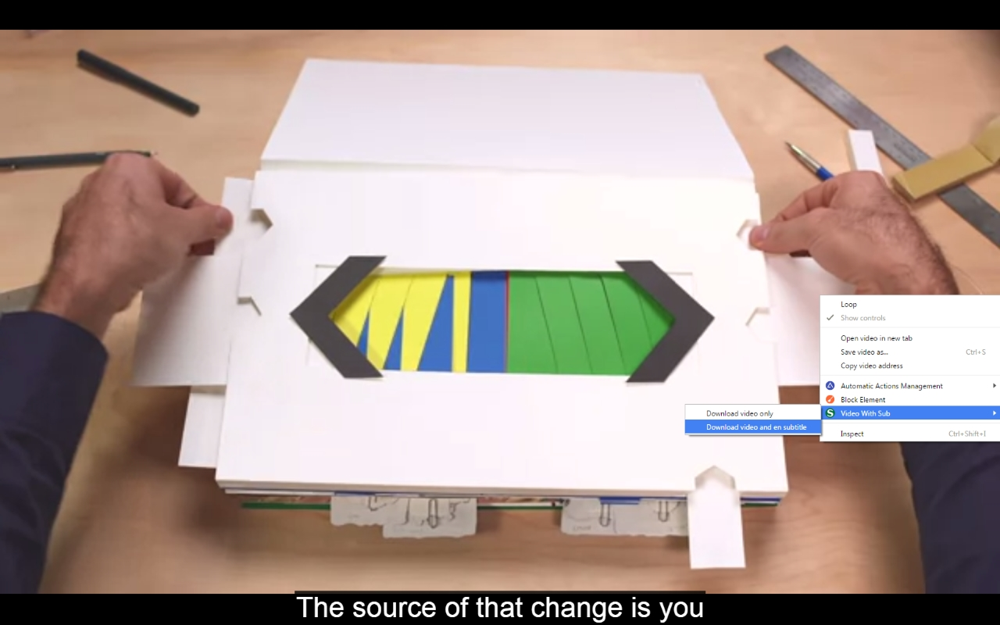
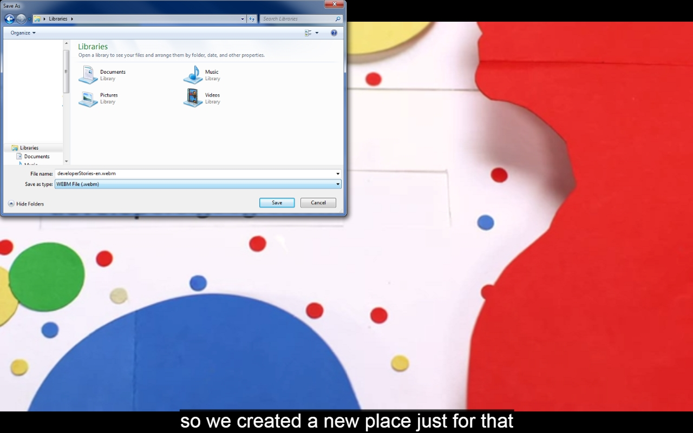
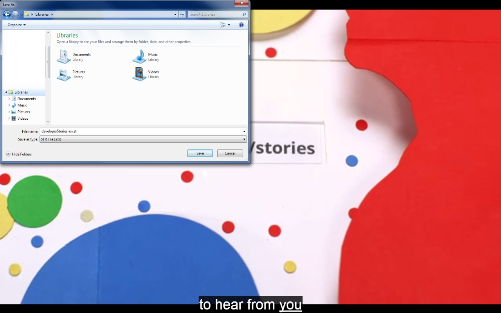
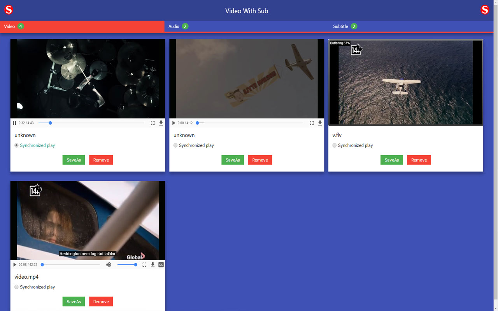

# Subtitle Downloader
This extension will able to download HTML5 video, audio and subtitle.

[ChromeStore] - Extension in store

Version
----
2.1.0
	- Fix some minor bug
	- Youtube video + audio synchronized playback
  	- Update user interface with w3.CSS

Version
----
2.0.0
	- New user interface with w3.CSS
	
Version
----
1.5.0
	- Add Collect video, audio, subtitle url (youtube partially working)
	- Drop subtitle to html5 video (Playback vindow)
	- Save as video, audio, subtitle in Playback vindow
	- flash video supported 

Version
----
1.2.0
	- Some minor bug fixed

Version
----
1.0.0

Example usage
----
	- Right click on the selected Video
	- Select available download method from context menu
	- Select folder to save Video and Subtitle 

   

   

   

   

   

License
----

MIT

Author: Tóth András
---

   http://atandrastoth.co.uk/

   2016-05-02

[ChromeStore]:https://chrome.google.com/webstore/detail/video-with-sub/gkolkfoonnghlgihmkclhbnnoidmgfoe

